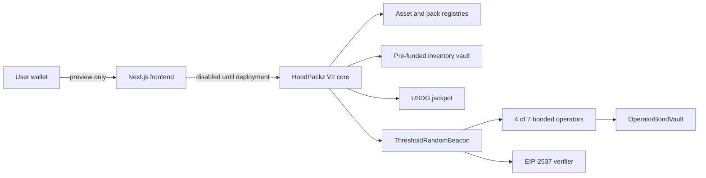

# HoodPackz

HoodPackz is a planned meme-token pack protocol for Robinhood Chain. Each pack will deliver three different admitted meme tokens using bonded 4-of-7 threshold BLS randomness.

> **Current status: V2 preview.** The bonded randomness contracts and frontend preview are implemented. The HoodPackz pack core, asset registry, inventory vault, production BLS verifier, and mainnet deployment do not exist yet. The application cannot approve tokens or move user funds.

[](https://github.com/Jaredweb3here/hoodpackz/actions/workflows/contracts.yml)
[](https://github.com/Jaredweb3here/hoodpackz/actions/workflows/frontend.yml)
[](LICENSE)
[](#launch-gates)

## Product specification

| Property | V2 specification |
| --- | --- |
| Network | Robinhood Chain mainnet, chain ID `4663` |
| Payment | USDG or WETH |
| Pack tiers | `5`, `15`, and `50` USDG |
| Pack contents | Three different admitted meme tokens |
| Economics | 80% prize EV, 10% USDG jackpot, 10% protocol fee |
| Randomness | Bonded 4-of-7 threshold BLS |
| Exposure | Capped by slashable quorum collateral |

The frontend intentionally keeps opening disabled until a HoodPackz V2 core address and production ABI are configured.

## Verified preview assets

The preview pool uses seven ERC-20 contracts verified directly through the public Robinhood Chain RPC at `https://rpc.mainnet.chain.robinhood.com` (chain ID `4663`):

| Token | Contract |
| --- | --- |
| CASHCAT | `0x020bfc650a365f8bb26819deaabf3e21291018b4` |
| Index | `0x56910d4409f3a0c78c64dd8d0545ff0705389870` |
| JUGGERNAUT | `0xd7321801caae694090694ff55a9323139f043b88` |
| RWA | `0x4a380618777eed8d513bcd6e983df3c5d2ba7777` |
| PONS | `0x39dbed3a2bd333467115de45665cc57f813c4571` |
| TENDIES | `0x45242320dbb855eea8fd36804c6487e10e97fcf9` |
| WALLET | `0x0339f5459fc690ac85f1782e15782a151b4a9e1b` |

The contracts and ERC-20 metadata are real. Their inclusion remains preview-only until asset admission, liquidity testing, inventory funding, and the V2 core deployment are complete.

## Implemented

- Append-only threshold-key epochs.
- USDG operator bonds, delayed withdrawals, locks, and slashing.
- Aggregate-first finalization and attributable rescue shares.
- Exposure capacity bounded by the four smallest available operator bonds.
- Retryable delivery separated from immutable randomness finalization.
- Fail-closed legacy randomness and zero-exposure request paths.
- Responsive HoodPackz pack preview with wallet/network controls.
- Disabled state-changing HTTP routes until V2 deployment.

The Foundry suite currently contains 89 passing tests. Fork suites skip automatically outside chain ID `4663`.

## Not implemented

- Production EIP-2537 BLS verifier and cross-implementation vectors.
- DKG ceremony and seven independent production operators.
- Meme-token admission policy implementation and asset registry.
- Pack registry, pre-funded inventory vault, pack core, jackpot, and WETH router.
- Production deployment, external audit, and legal approval.

## Architecture



See [ARCHITECTURE.md](ARCHITECTURE.md), [SECURITY.md](SECURITY.md), and [AUDIT_SCOPE.md](AUDIT_SCOPE.md).

## Quick start

```bash
npm ci
npm run dev
```

The frontend defaults to `http://localhost:3000`. In paths containing non-ASCII characters, the scripts use Webpack because the current Turbopack release can panic while constructing output identifiers.

Contracts:

```bash
cd contracts
forge build
forge test
```

## Launch gates

Mainnet opening stays disabled until all of the following are complete:

1. Exact BLS ciphersuite, DST, serialization, canonical checks, and test vectors.
2. Production EIP-2537 verifier review.
3. Independent operator selection, DKG, share custody, and bond sizing.
4. Asset admission and liquidity tests.
5. HoodPackz core, vault, registry, router, and invariant tests.
6. Safe/timelock administration and deployment rehearsal.
7. External security audit and legal approval.

## Legacy boundary

The repository retains the original StockPackz contracts, SDK, documentation, and components for attribution and migration analysis. They are legacy code and are not the HoodPackz V2 production path. The root frontend and public state-changing endpoints do not route funds into the legacy deployment.

## License

[MIT](LICENSE). Original StockPackz attribution is preserved in repository history and legacy source files.
