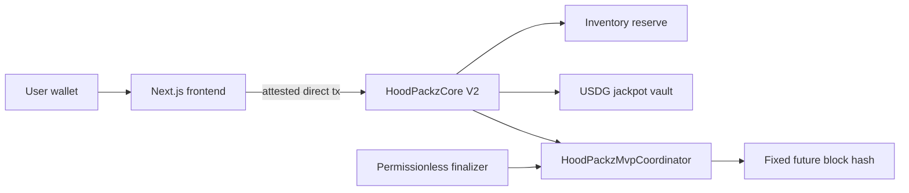

# Pakz.fun

**Onchain token drops. Three funded rewards per pull. Simple beta settlement.**

[](https://pakz.fun)
[](https://robinhoodchain.blockscout.com)
[](LICENSE)
[](contracts/)

**CA:** [`0x558530c1e1c58e0a90e98ea735d0f4f0147f7777`](https://robinhoodchain.blockscout.com/address/0x558530c1e1c58e0a90e98ea735d0f4f0147f7777)

**X:** [@pakzdotfun](https://x.com/pakzdotfun)

---

## What is Pakz.fun

You pay USDG. You get three real ERC-20 meme tokens from a seven-asset pool. The beta fixes a future Robinhood block when the purchase is created and derives the draw from that block hash. Anyone can finalize the draw after the block exists. Every possible prize is reserved before payment and every dollar follows a published split.

**[Open the live mainnet app at pakz.fun](https://pakz.fun)**

Pack sales remain fail-closed until the simplified coordinator and replacement core are deployed, funded, audited, and proven with one real end-to-end opening. See the [mainnet status report](docs/15-mainnet-status.md).

The 4-of-7 threshold BLS system remains visible in source as an experimental upgrade under development. It is not the beta launch path. See [`contracts/src/randomness/THRESHOLD_BLS_EXPERIMENTAL.md`](contracts/src/randomness/THRESHOLD_BLS_EXPERIMENTAL.md).

---

## Pack tiers

| Tier | Price | You get |
|------|-------|---------|
| Trencher | 5 USDG | 3 tokens from the pool |
| Cashcat Max | 15 USDG | 3 tokens from the pool |
| Techpro | 50 USDG | 3 tokens from the pool |

Higher tier = more tokens per slot. Same seven-asset pool, same randomness.

---

## Deployed contracts — Robinhood Chain (4663)

| Contract | Address | Explorer |
|----------|---------|---------|
| **Legacy HoodPackzCore V2 (paused)** | `0x5337Ad84857E433b7d57Ca1130079044Ef37e436` | [view](https://robinhoodchain.blockscout.com/address/0x5337Ad84857E433b7d57Ca1130079044Ef37e436) |
| **Archived ThresholdRandomBeacon** | `0x2B4547eAf629dE637C28146C3104e83f1F0AE7dc` | [view](https://robinhoodchain.blockscout.com/address/0x2B4547eAf629dE637C28146C3104e83f1F0AE7dc) |
| **Archived BLS12381Verifier** | `0xf500CBd6bE6CCa621a0Bca39e384729E51ECF1c8` | [view](https://robinhoodchain.blockscout.com/address/0xf500CBd6bE6CCa621a0Bca39e384729E51ECF1c8) |
| **USDG** | `0x5fc5360D0400a0Fd4f2af552ADD042D716F1d168` | [view](https://robinhoodchain.blockscout.com/address/0x5fc5360D0400a0Fd4f2af552ADD042D716F1d168) |

---

## Token pool

Seven ERC-20 meme tokens verified on Robinhood Chain mainnet:

| Token | Ticker | Contract |
|-------|--------|---------|
| Cash Cat | CASHCAT | [`0x020b...018b4`](https://robinhoodchain.blockscout.com/token/0x020bfc650a365f8bb26819deaabf3e21291018b4) |
| The Index | INDEX | [`0x5691...9870`](https://robinhoodchain.blockscout.com/token/0x56910d4409f3a0c78c64dd8d0545ff0705389870) |
| The Juggernaut | JUGGERNAUT | [`0xd732...3b88`](https://robinhoodchain.blockscout.com/token/0xd7321801caae694090694ff55a9323139f043b88) |
| Real World Assets | RWA | [`0x4a38...7777`](https://robinhoodchain.blockscout.com/token/0x4a380618777eed8d513bcd6e983df3c5d2ba7777) |
| Pons | PONS | [`0x39db...4571`](https://robinhoodchain.blockscout.com/token/0x39dbed3a2bd333467115de45665cc57f813c4571) |
| Tendies | TENDIES | [`0x4524...cf9`](https://robinhoodchain.blockscout.com/token/0x45242320dbb855eea8fd36804c6487e10e97fcf9) |
| Robinhood Wallet | WALLET | [`0x0339...e1b`](https://robinhoodchain.blockscout.com/token/0x0339f5459fc690ac85f1782e15782a151b4a9e1b) |

---

## Economics

Every pack purchase follows one fixed split, enforced onchain:

```
80%  →  Inventory reserve   (funds the three-token payout)
10%  →  USDG jackpot vault  (1/25,000 odds, 90% of vault paid out)
10%  →  Protocol fee
```

---

## How beta randomness works

```
1. REQUEST   — the purchase fixes a future Robinhood block number
2. WAIT      — all possible prizes and payment liabilities stay reserved
3. FINALIZE  — anyone derives the random words from that fixed block hash
4. CLAIM     — the user claims three unique tokens, or refunds if the hash expires
```

The finalizer supplies no entropy and has no privileged role. This is a transparent beta mechanism, not VRF: Robinhood block producers can influence block contents and, in an extreme case, a block hash. The planned threshold BLS upgrade is retained in source but is not required for beta sales.

---

## Architecture



---

## Repository structure

```
contracts/         Foundry — HoodPackzCore, MVP coordinator, experimental BLS stack
  src/v2/          HoodPackzCore.sol
  src/randomness/  HoodPackzMvpCoordinator plus archived threshold upgrade
  script/          MVP and experimental deployment scripts
  test/            Full Forge test suite
src/               Next.js 14 frontend
  app/             page.tsx — pack UI
  lib/             chain, tokens, contract interaction
scripts/           Mainnet simulation plus experimental DKG/BLS tooling
```

---

## Local development

```bash
npm ci
npm run dev          # http://localhost:3000
```

```bash
cd contracts
forge build
forge test
```

---

## Security

- Frontend verifies codehash and constructor config hash before every transaction
- Pack sales are fail-closed (`openingsPaused = true` by default)
- No operator private keys or deployer keys on Vercel
- Future-block finalization requires no privileged entropy signer
- Full Forge suite: unit, integration, fork tests

See [SECURITY.md](SECURITY.md) for threat model and [AUDIT_SCOPE.md](AUDIT_SCOPE.md) for scope.

---

## License

[MIT](LICENSE)
